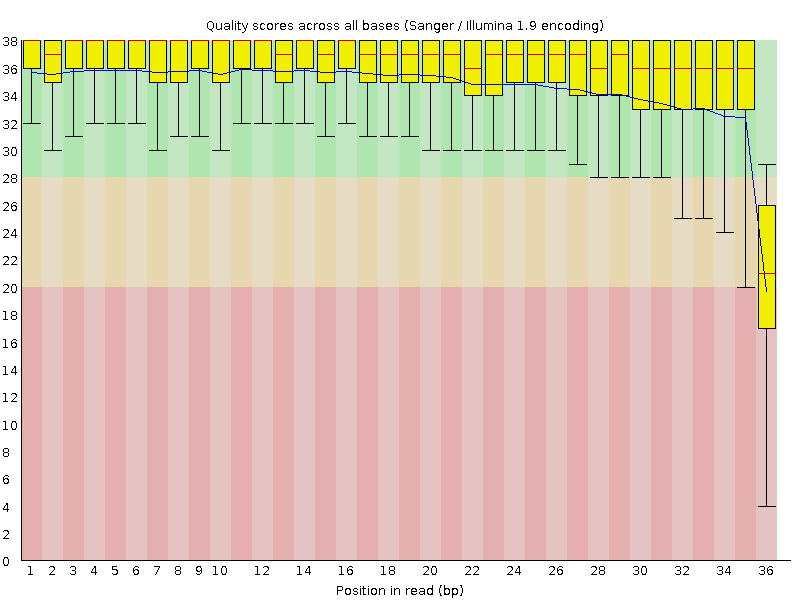
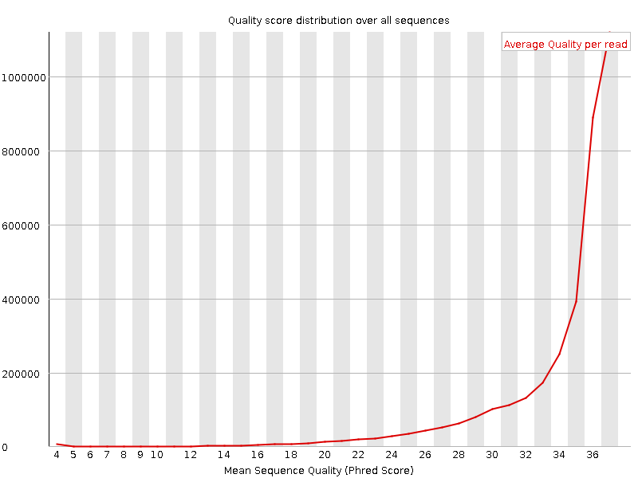
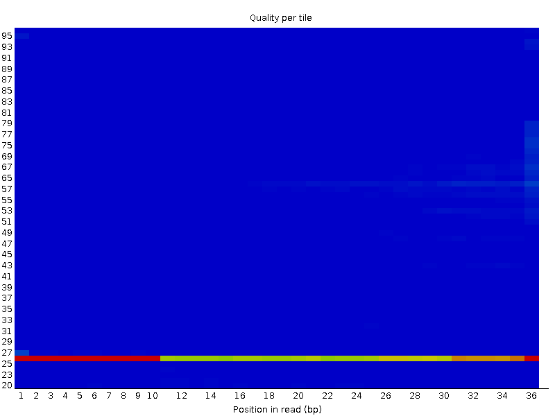
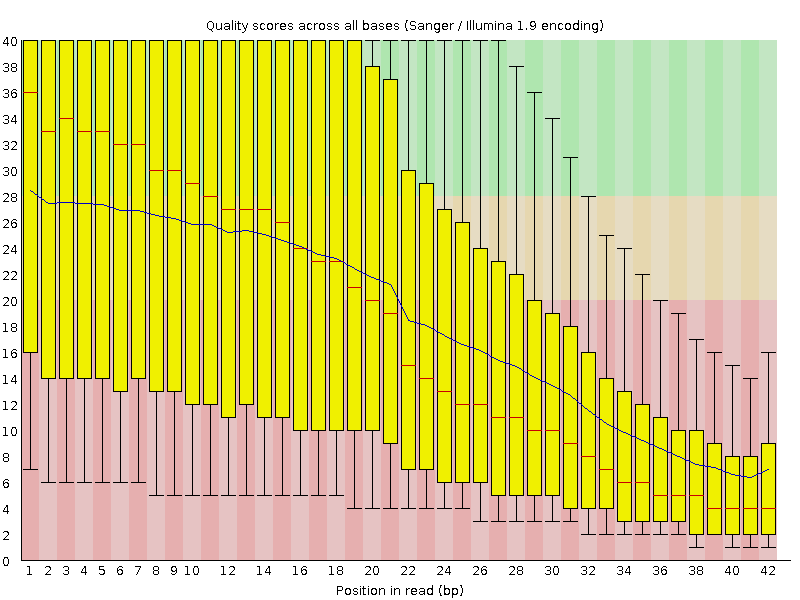
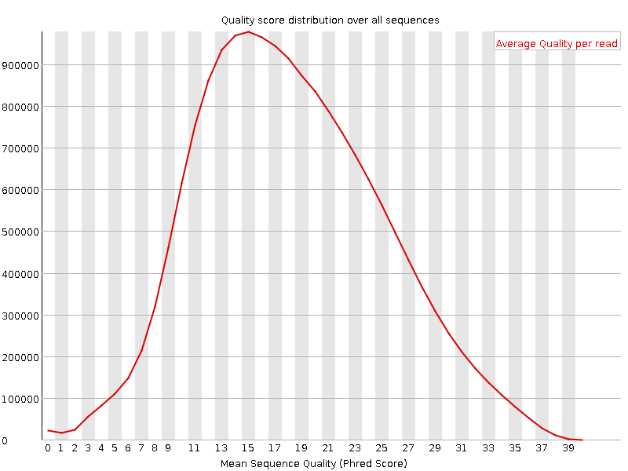
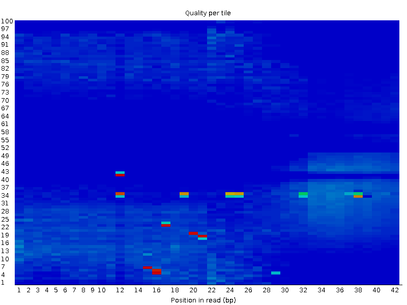

### Commands:

We first logged in in the LAVIS Cluster, created a Screen session and created a folder with the same name, in order to organize our work on it.

```
cd /mnt/Timina/bioinfoII/data/alignment
cp Escherichia_coli_K12_MG1655.fasta  /mnt/Timina/bioinfoII/user/Alignment
cp SRX189773_FNR_ChIP.fastq /mnt/Timina/bioinfoII/user/Alignment
cp mus_musculus_CEBPA_liver_ERR005132.fastq.gz /mnt/Timina/bioinfoII/user/Alignment 
cd /mnt/Archives/genome
cd mouse/mm10/UCSC/bwa-0.7.15-index
cp -r index /mnt/Timina/bioinfoII/user/Alignment 

```
Secondly, we copied the files we needed in our directory. This files were *Escherichia_coli_K12_MG1655.fasta* , *mus_musculus_CEBPA_liver_ERR005132.fastq.gz* , 
*SRX189773_FNR_ChIP.fastq and the directory index/.* 

### Modules used: 
```
module load samtools
module load fastqc
module load bwa

```
Then loaded the applications needed.

### Commands

```
mkdir Mouse
mkdir Ecoli
mv SRX189773_FNR_ChIP.fastq Ecoli/
cd Ecoli/
mkdir index
mv Es* ./Ecoli/index/
mv -u index Mouse
mv mus_musculus_CEBPA_liver_ERR005132.fastq.gz Mouse

```
Finally, we created a folder per each species to make our practice easier to handle and moved each file to its corresponding folder. 

# *E.coli* Genome

## Using bwa index *E. coli* genome

### Commands

```
cd index/
bwa index -p E_index Escherichia_coli_K12_MG1655.fasta

```
**Result**

E_index.amb

E_index.ann
 
E_index.bwt

E_index.pac

E_index.sa

The command bwa index was used to index the *E Coli* genome and a prefix (E_index) was established for an easier use of  it. 

## Quality Control
```
fastqc SRX189773_FNR_ChIP.fastq
```
The command fastqc allows us to obtain the Fastqc report from our fastq file.

**Result**

SRX189773_FNR_ChIP_fastqc.zip
SRX189773_FNR_ChIP_fastqc.html

When we unzip and analized the results generated from the quality control. The following is obtained:

**Analysis**

According to the images below, that correspond to the FastQ report, wee can predict how confident our data is. Almost all of positions are in just in the green and high confident area *(Fig 1)*. In fact, we can observe that our reliability is above the acceptable reliability, being 34 the quality score average of our data *(Fig 1.1)*. Finally, in image *1.2* is clear that the sequence 26/27 seem to present a poor quality in varios positions (according to the hotter colors that appear).

### Per Base Sequence Quality

```{r echo = FALSE}


```
*(Fig 1.)*

### Per Sequence Quality
```{r echo = FALSE}


```
*(Fig 1.1)*

### Per Tile Sequence Quality
```{r echo = FALSE}


```
*(Fig 1.2)*

## Reads Alignment from the FNR ChIP-seq experiment

### Commands
```
#generate a .bwa for the alignment
bwa aln -t 4 E_index ./SRX189773_FNR_ChIP.fastq> Ecoli.bwa
#Make a .sam
bwa samse E_index Ecoli.bwa ./SRX189773_FNR_ChIP.fastq > Ecoli.sam

```
**Result**

Ecoli.bwa

Ecoli.sam


The bwa aln command was used to begin with the alignment of the genome. We stablished 4 threads and wrote the index prefix to accelerate the process *(bwa aln -t 4 E_index )*. Then, we gave the command the location of the chip seq file, its name and ask the result to be printed in a bwa file *(Ecoli.bwa)*. 

In the second command, the bwa command generated the alignment in the SAM format given the index prefix (E_index), bwa file*(Ecoli.bwa)* and the location of the Chipseq file *(./SRX189773_FNR_ChIP.fastq)*. The result is given in a sam file *(> Ecoli.sam)*

## Read Results

### Command 
```
samtools stats Ecoli.sam
```
**Result**

*sequences:*    3603544

*1st fragments:*    3603544

*reads mapped:*    2341862

*reads unmapped:*    1261682

*total length:*    129727584

*total first fragment length:*    129727584

*bases mapped:*    84307032

*bases mapped (cigar):*    84307032

*mismatches:*    229130

*error rate:*    2.717804e-03    # mismatches / bases mapped

*average length:*    36

*average first fragment length:* 36

*maximum length:*    36

*average quality:*    34.6

# Mouse Genome

## Index Creation

Index is ready in /index/  
In the process of the alignment of the Mouse Genome we sent a job due to the long time the alignment lasts. 

## Quality Control

```
fastqc mus_musculus_CEBPA_liver_ERR005132_fastqc.gz
```
The command fastqc allows us to obtain the Fastqc report from our fastq file.

**Result**

mus_musculus_CEBPA_liver_ERR005132_fastqc.zip
mus_musculus_CEBPA_liver_ERR005132_fastqc.html


When we unzip and analized the results generated from the quality control we obtained:

**Analysis**

In this case, we can observe we have a quality problem. More than the half of the sequences have a inadequate 
quality score *(Fig 2)* which is a problem if we want to trust uin this data and its results. Our  quality score average is around 15 (*Fig 2.1)* and we can observe in *Fig 2.2*  a lot of PHRED scores as low as a 6, which means there is a great intervl of error. If we want to work with this data we have to be really careful with our conclusions and not actually treat the results as significant important. In the future perhaps it would be interesting to work with just those sequences with acceptable scores. 

### Per Base Sequence Quality
```{r echo = FALSE}


```
*(Fig 2)*

### Per Sequence Quality
```{r echo = FALSE}


```
*(Fig 2.1)*

### Per Tile Sequence Quality
```{r echo = FALSE}


```
*(Fig 2.2)*

**Analysis**

## Alignment Job

```
#!/bin/bash
#
# Use Current working directory
#$ -cwd
#
# Join stdout and stderr
#$ -j n
#
# Run job through bash shell
#$ -S /bin/bash
#
#
# Job name
#$ -N m_alignment
#
# Send an email after the job has finished
#$ -m e
#$ -M *****@gmail.com
#
#
# If modules are needed, source modules environment (Do not delete the next line):
. /etc/profile.d/modules.sh
#
# Module required:
module load bwa
#
# Commands

#alignment with bwa mem
bwa mem -M -t 7 index/mm10.fa mus_musculus_CEBPA_liver_ERR005132.fastq.gz> m_al_mem.sam


```

Each process of the job is described in a comment by a # sign. The last commands correspond to the manipulation of the genome and creation of results. 

The first command generates a sam file *(m_al_mem.sam)* with the command *bwa mem* that allows us to align the genome in 7 threads *(-t)* with the help of the index files *(index/mm10.fa)* and the fastq file *(mus_musculus_CEBPA_liver_ERR005132.fastq.gz)*. 

**Result**


*raw total sequences:* 17,171,130

*sequences:* 17171130

*1st fragments:* 17171130

*reads mapped:* 6,517,831

*reads unmapped:* 10,653,299

*bases mapped:* 273,748,902/ 256,529,512 (cigar)

*mismatches:* 5,371,871

*error rate:* 2.094056e-02 # mismatches / bases mapped

*average length:* 42

*average quality:* 18.7


# Bibliography

(4. Implementación — GNU/Linux para Bioinformática, s/f)
4. Implementación — GNU/Linux para Bioinformática. (s/f). Github.io. Recovered the 25 Feb 2023 from [Implementación](https://rsg-ecuador.github.io/unix.bioinfo.rsgecuador/content/Curso_basico/07_SAM_Tools/3_impl.html)

(bwa.1, s/f)
bwa.1. (s/f). Sourceforge.net. Recovered the 25 Feb 2023 from [Manual Reference Pages](https://bio-bwa.sourceforge.net/bwa.shtml)

(Samarajiwa, s/f)
Samarajiwa, S. (s/f). Sequence alignment with BWA. Github.io. Recovered the 26 Feb 2023 from
[Sequence Alignment with BWA](http://bioinformatics-core-shared-training.github.io/cruk-bioinf-sschool/Day1/Sequence%20Alignment_July2015_ShamithSamarajiwa.pdf)
